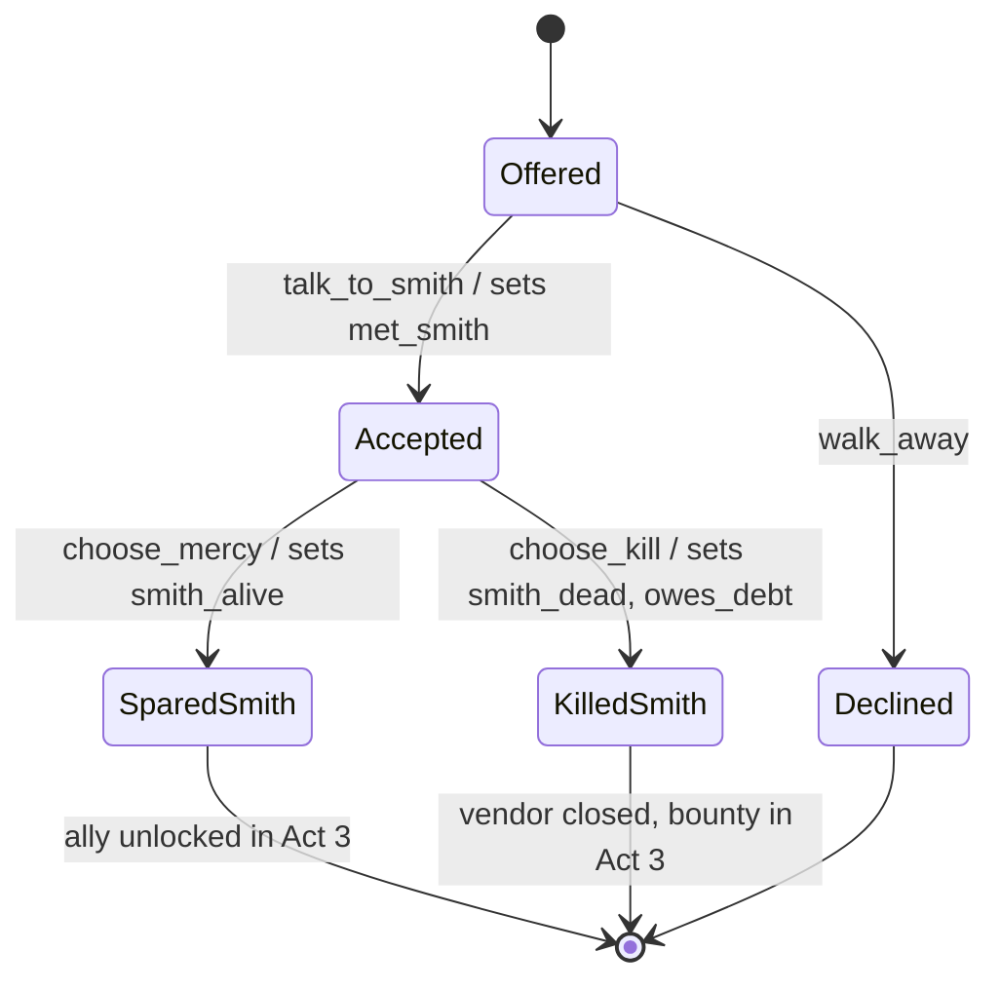

# Game narrative-design skill

You are producing a **narrative-design** artifact — a world bible, a quest graph,
a dialogue node set, or a character sheet. The job is structural, not literary:
narrative in a game is a **state machine the player drives**, not prose the player
reads. The engineering-side `game-design` skill in pair-programmer owns the
flat narrative-bible outline; this skill adds the graph topology, the
state-change contract, the per-locale localization budget, and the
cultural-safety hooks that route to The Arbiter (`esrb-pegi-iarc-rating`).

## The cardinal rule

> A branch must **branch**. If two choices lead to the same state with only
> cosmetic dialogue differences, that is the illusion of choice — delete it or
> make it change state. Every branch records a state delta a later beat reads.
> If no later beat reads the delta, the choice is theater.

## Anti-patterns to refuse

- **Prose dumps instead of beats** — a wall of lore the player can't act on.
  Narrative is delivered through play; write beats (what changes / what's
  revealed / what new tension) not chapters.
- **Exposition without player agency** — a 4-minute cutscene the player watches.
  Every exposition beat earns its place by giving the player a choice, a verb,
  or a navigable space.
- **Branching that doesn't branch** — choices with no state delta. The illusion
  of choice (Telltale-without-the-callback) erodes trust. Every branch sets a
  flag a later node reads.
- **Untranslatable wordplay with no loc budget** — puns, accents-as-text, and
  culture-bound idioms that explode localization cost. Flag them or give them a
  per-locale budget and a fallback.
- **Characters with no "never-say" list** — voice is defined as much by the lines
  a character would refuse as the lines they speak.
- **Themes stated, not dramatized** — "this game is about grief" in the pitch but
  no beat where a mechanic or choice embodies grief.
- **Cultural content with no safety hook** — religious iconography, real-world
  conflicts, ethnic depictions shipped without an Arbiter review pointer.

## Templates

### narrative_bible template

```
# <Title> — Narrative Bible

## Premise (≤80 words)
<The dramatic question, not the plot summary.>

## World pillars (3-5, tone-load-bearing)
<Each a constraint on what stories are tellable here.>

## Geography / factions / history (only what the player can touch)
<Cut anything no beat or location surfaces.>

## Themes (dramatized, not stated)
| Theme | Embodied by (mechanic / choice / beat) |
| <grief> | <permadeath of a companion you can't revive> |

## Tone & voice rules
<Register, average line length, profanity policy, humor type. 2 reference
titles (a game + a non-game).>

## Localization posture
| Locale | Tier | Budget (words / VO lines) | Cultural-safety flags |
| en-US  | source | <50k words / 8k lines> | — |
| ja-JP  | full   | <55k / 8k> | honorific system, name order |
| ar     | full-RTL | <52k / 8k> | RTL layout, content-safety review |
| zh-CN  | full   | <48k / 8k> | content-safety (→ Arbiter), SARFT |
<Flag untranslatable wordplay here with its fallback.>

## Cultural / content-safety hooks (→ The Arbiter)
<List depictions requiring esrb-pegi-iarc-rating review BEFORE production:
violence tier, substances, gambling-adjacent, religious/political content.
Each routes to The Arbiter as a HANDOFF.>

## Accessibility note
<Subtitle defaults, speaker labels, text-size floor, no-audio-only-plot rule.
Cross-ref game-accessibility-guidelines.>
```

### Quest-graph template (Mermaid state machine)

```
# Quest graph — <Quest Name>

State flags this quest reads:  [met_smith, has_key]
State flags this quest sets:   [smith_alive | smith_dead, owes_debt]



## Branch payoff ledger (proves branches branch)
| Branch | State delta | Later beat that READS it | Verified by |
| spare  | smith_alive | Act3 ally dialogue       | Warden state-coverage test |
| kill   | smith_dead  | Act3 bounty encounter    | Warden state-coverage test |
```

### Dialogue-node template

```
# Dialogue node — <id: smith_offer_01>

Speaker: <The Smith>
Preconditions (flags): [met_smith == false]
Line (source en-US): "<≤140 chars; voice-rule compliant>"
VO direction: <emotion, pace>  | Loc length budget: <±15% per locale>

Choices:
| id | player line | sets flag | goes to | gated by |
| a  | "I'll help" | accepts_quest | smith_offer_02 | — |
| b  | "What's in it for me?" | — | smith_haggle_01 | charisma≥3 |
| c  | [walk away]  | declined | [exit] | — |

Never-say check: <confirm no line violates any character never-say list>
```

### Character sheet template

```
# Character — <Name>

## Want (drives every scene)
<The concrete object of desire. Not "to be happy" — "to reclaim the forge".>

## Need (what the arc teaches them)
<Often in tension with the want.>

## Arc (beats)
<Start state → turn → end state. 3-5 beats, each a state change.>

## Voice (how they speak)
<Diction, rhythm, tells, 1 signature phrase.>

## NEVER-SAY (mandatory)
<3-5 lines/registers this character would refuse. Defines voice by negation.>

## Localization notes
<Anything voice-specific that resists translation; per-locale budget.>
```

## Constraints

- Every branch MUST set a state delta that a later beat reads (branch payoff
  ledger), or it is cut as illusion-of-choice.
- Every character MUST have a want and a never-say list.
- Narrative ships as beats and state machines, not prose dumps; every exposition
  beat MUST grant agency.
- Every artifact carries a per-locale localization budget and flags
  untranslatable content with a fallback.
- Cultural/content-safety content routes to The Arbiter via HANDOFF before
  production (cross-ref `esrb-pegi-iarc-rating`); never ship sensitive content
  ungated.
- Every artifact carries an accessibility note (subtitles, speaker labels,
  no-audio-only-plot; cross-ref `game-accessibility-guidelines`). Online live
  narrative carries a server-authority note (who owns quest state; cross-ref
  `server-authority-fairplay`); monetized story content carries a per-region note
  (cross-ref `loot-box-jurisdiction`).
- Cite reference titles for tone and branching precedent (e.g. Disco Elysium for
  voice density, Outer Wilds for player-driven revelation).
- Produces only design/spec markdown. Final prose/VO copy is a `CREATIVE_BRIEF`
  to garland (Erato); never author final VO or render audio here. See
  `game-studio-pipeline`.
