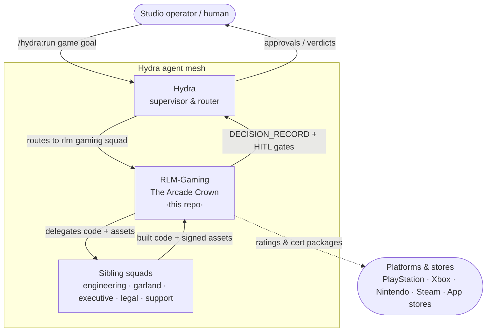
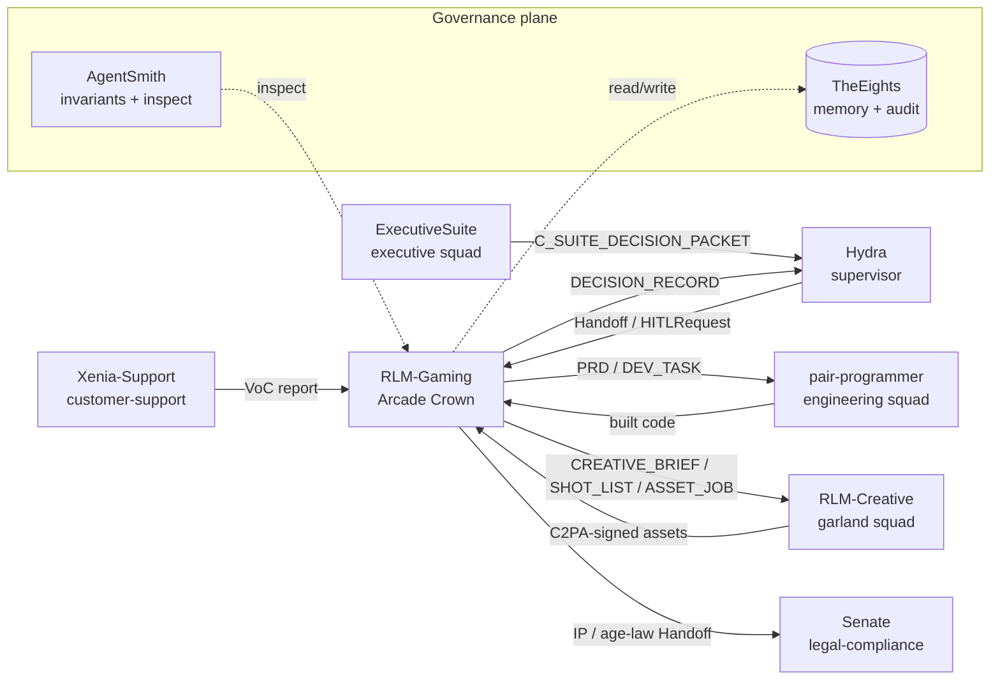
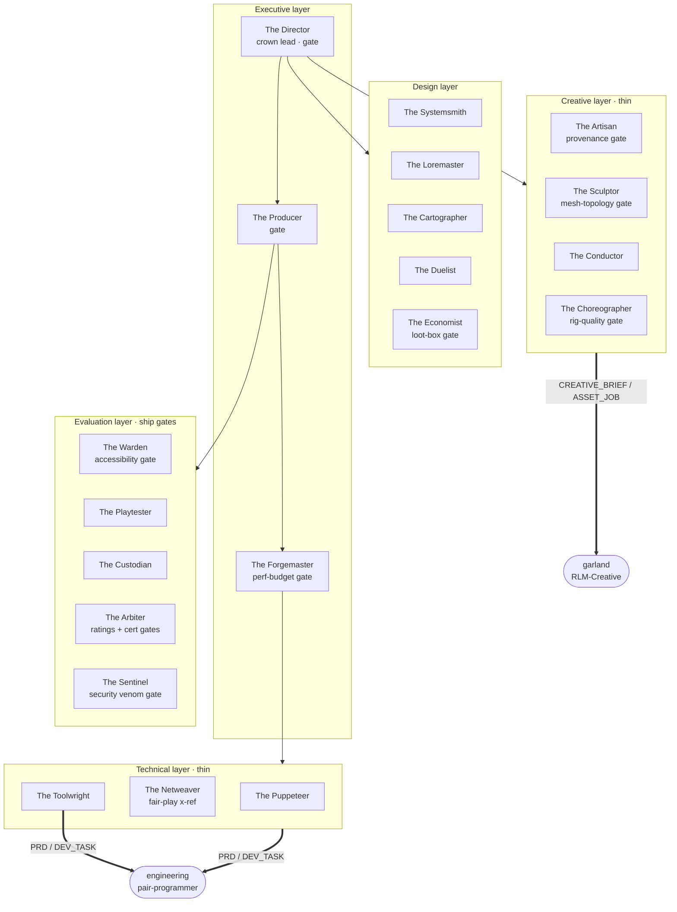
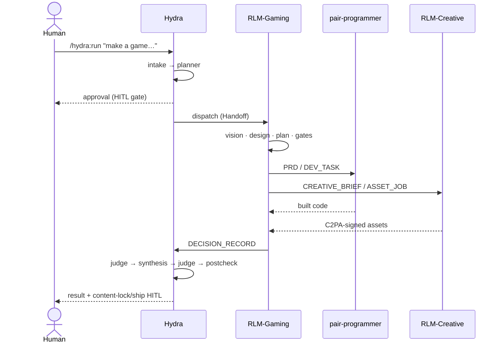

# RLM-Gaming 🕹️ — The Arcade Crown

[](./LICENSE)
[](https://github.com/lebobo88/Hydra)
[](./.claude-plugin/plugin.json)
[](#5-the-roster--20-heads)
[](#13-roadmap)

> **A senior, multi-agent game studio that runs as a [Hydra](https://github.com/lebobo88/Hydra) squad pack.**
> RLM-Gaming owns the *studio-brain* layers — vision, design, production, live-ops,
> QA/balance, and compliance — and **delegates the build**: engine code goes to
> **pair-programmer**, art/audio/video goes to **RLM-Creative (Garland)**. It produces
> **design, plans, specs, and gates** — never engine source, never media binaries.

The full architecture spec lives in **[`RLM-GAMING.md`](./RLM-GAMING.md)**; the
foundational design rationale is in the [Blueprint document](./Blueprint%20for%20a%20Multi-Agent%20AI%20Game%20Studio%20%20Senior%20Expert%20Agents%20and%20Skill%20Matrix%20for%20End-to-End%20Game%20Creation.md).

---

## Table of contents

1. [What this is](#1-what-this-is)
2. [The cardinal rule](#2-the-cardinal-rule)
3. [Capabilities](#3-capabilities)
4. [The five studio layers](#4-the-five-studio-layers)
5. [The roster — 20 heads](#5-the-roster--20-heads)
6. [Skills (16)](#6-skills-16)
7. [Commands (9)](#7-commands-9)
8. [Gates & HITL control points](#8-gates--hitl-control-points)
9. [Usage](#9-usage)
10. [How it ties into the Hydra ecosystem](#10-how-it-ties-into-the-hydra-ecosystem)
11. [C4 architecture diagrams](#11-c4-architecture-diagrams)
12. [Sibling repositories](#12-sibling-repositories)
13. [Repository layout](#13-repository-layout)
14. [Roadmap](#14-roadmap)
15. [License & provenance](#15-license--provenance)

---

## 1. What this is

**RLM-Gaming** — codename **The Arcade Crown** — is a pack of **20 specialized
AI agents ("heads")** organized like a real game studio's senior leadership. Each
head is a domain expert (game director, systems designer, netcode lead, economy
designer, QA/balance lead, ratings & cert officer, anti-cheat/security gate, …)
with its own charter, model tier, tool scope, and — where it owns a quality
bar — an acceptance **gate**.

The crown does the work a studio's *brains* do: it decides **what** to build and
**why**, specs **how** it should behave, plans the production, runs QA and
balance, handles ratings/cert/compliance, and gates the ship. It does **not**
write the engine code or generate the art — it hands those out as typed jobs to
sibling squads and reviews what comes back.

It ships as a **Claude Code plugin** (`rlm-gaming`, see
[`.claude-plugin/plugin.json`](./.claude-plugin/plugin.json)) and registers with
[Hydra](https://github.com/lebobo88/Hydra) as the `rlm-gaming` squad, so a single
`/hydra:run "make a game…"` routes straight into the studio.

## 2. The cardinal rule

> **If the deliverable is engine source → emit a `PRD` / `DEV_TASK` to engineering.**
> **If the deliverable is an image/audio/video/3D binary → emit a `CREATIVE_BRIEF` / `SHOT_LIST` / `ASSET_JOB` to garland.**
> **Everything the crown keeps is text:** design docs, specs, plans, simulations, and gate verdicts.

This separation is what keeps a 20-agent studio coherent: the crown stays the
single source of design truth, while the muscle (code generation, asset
rendering) lives in independently-shippable sibling squads with their own
provenance and review.

## 3. Capabilities

What the Arcade Crown can produce end-to-end, with the owning head, the skill it
draws on, and the gate it answers to:

| Capability | Owning head(s) | Skill | Gate |
|---|---|---|---|
| Vision one-pager · testable pillars · greenlight memo | The Director | `game-vision-and-pillars` | `game-design-pillars-testable` |
| Production backlog · milestones · sprints · critical path | The Producer | `game-studio-pipeline` | — (HITL control points) |
| Engine selection · tech standards · per-platform perf budgets | The Forgemaster | `game-engine-targets` | `game-perf-budget` |
| Mechanics & systems specs · combat math · emergence/exploit analysis | The Systemsmith, The Duelist | `game-systems-design` | — |
| World bibles · branching narrative (quest graphs) · dialogue trees | The Loremaster | `game-narrative-design` | — |
| Level/world greybox · pacing diagrams · PCG pipelines (engine units) | The Cartographer, The Duelist | `level-and-world-design` | — |
| Encounter & boss design · enemy archetypes · AI tuning targets | The Duelist | `game-systems-design` | — |
| Economy sims · gacha/loot math · retention/LTV KPIs · store A/B | The Economist | `game-economy-and-monetization` | `loot-box-jurisdiction` |
| Runtime NPC AI design (BT/GOAP/HTN/Utility/EQS, perception, NavMesh) | The Puppeteer | `game-ai-behavior` | — |
| Netcode model · server-authority boundaries · rollback/lockstep | The Netweaver | `game-netcode-and-multiplayer` | `server-authority-fairplay` |
| Editor tooling · import/build pipelines · CI hooks (specs) | The Toolwright | `game-studio-pipeline` | — |
| Art direction · style bible · LOD/poly/texture budgets | The Artisan | `game-art-and-audio-direction` | `ai-content-provenance` |
| 3D modeling/DCC · topology/retopo/UV/PBR/LOD · Blender commission contract | The Sculptor | `game-3d-modeling-and-dcc` | `mesh-topology-budget` |
| Audio direction · mix tiers · Wwise/FMOD event maps | The Conductor | `game-art-and-audio-direction` | — |
| Animation design · rigs · IK · skinning · blend trees · state machines | The Choreographer | `game-rigging-and-animation-pipeline` | `rig-quality` |
| QA strategy · bot playthroughs · balance Monte-Carlo · regression | The Warden | `game-qa-and-balance` | `game-accessibility-guidelines` |
| Synthetic playtests · fun-proxy metrics · friction/churn reports | The Playtester | `game-qa-and-balance` | — |
| Live-ops seasons · event cadence · hotfix runbooks · telemetry | The Custodian | `game-liveops-and-telemetry` | — |
| Age ratings · platform cert readiness · regional edits | The Arbiter | `game-cert-and-compliance` | `esrb-pegi-iarc-rating`, `platform-cert-readiness`, `loot-box-jurisdiction` |
| Fair-play security · anti-cheat · exploit threat models · secure RNG | The Sentinel | `game-security-and-anticheat` | `server-authority-fairplay`, `ai-content-provenance` |

## 4. The five studio layers

```
┌──────────────────────────────────────────────────────────────────┐
│  EXECUTIVE   The Director · The Producer · The Forgemaster         │
├──────────────────────────────────────────────────────────────────┤
│  DESIGN      The Systemsmith · The Loremaster · The Cartographer   │
│              The Duelist · The Economist                           │
├──────────────────────────────────────────────────────────────────┤
│  TECHNICAL   The Puppeteer · The Netweaver · The Toolwright        │
│              (thin — delegates implementation to engineering)      │
├──────────────────────────────────────────────────────────────────┤
│  CREATIVE    The Artisan · The Sculptor · The Conductor ·          │
│              The Choreographer (thin — commissions garland)        │
├──────────────────────────────────────────────────────────────────┤
│  EVALUATION  The Warden · The Playtester · The Custodian           │
│              The Arbiter · The Sentinel  ← ship gates              │
└──────────────────────────────────────────────────────────────────┘
```

## 5. The roster — 20 heads

`tier` is the head's authority class: **gatekeeper** (owns a blocking gate),
**execute** (produces artifacts directly), or **advisory** (designs/specs and
delegates implementation). Crown lead is **The Director**; the Cerberus-equivalent
security gate is **The Sentinel**.

### Executive layer
| Mythic name | Slug | Tier | Model | Charter |
|---|---|---|---|---|
| **The Director** | `the-director` | gatekeeper · crown lead | Opus 4.8 | Vision, testable pillars, greenlight; decomposes work to peer heads; gates the master `DECISION_RECORD`. Holds greenlight / content-lock / ship HITL. |
| **The Producer** | `the-producer` | gatekeeper | Sonnet 4.6 | Turns the decomposition into a backlog, milestones, sprints, critical path; tracks delegated code/asset jobs; runs the HITL control points. |
| **The Forgemaster** | `the-forgemaster` | gatekeeper | Opus 4.8 | Engine architecture, tech standards, build-vs-buy, per-platform perf budgets. Picks engine + pp profile, then delegates implementation. |

### Design layer
| Mythic name | Slug | Tier | Model | Charter |
|---|---|---|---|---|
| **The Systemsmith** | `the-systemsmith` | execute | Sonnet 4.6 | Mechanics & systems — verb/inputs/outputs/feedback/**failure-state**/counter-play, combat math, emergence, exploit-resistance. |
| **The Loremaster** | `the-loremaster` | advisory | Opus 4.8 | World bibles, branching narrative as quest graphs/state machines, dialogue trees, character arcs, localization budgets. |
| **The Cartographer** | `the-cartographer` | execute | Sonnet 4.6 | Levels & worlds, mission flow, pacing, critical/optional paths, PCG+LLM pipelines, navigation, streaming layout in engine units. |
| **The Duelist** | `the-duelist` | execute | Sonnet 4.6 | Encounters & bosses (readable phases), enemy archetypes (tell + counter-play), pacing; hands AI tuning targets to The Puppeteer. |
| **The Economist** | `the-economist` | execute | Sonnet 4.6 | Currencies, source/sink/leak tables, gacha & loot math, Monte-Carlo balance, progression, retention KPIs. Co-owns `loot-box-jurisdiction`. |

### Technical layer (designs the system, delegates the code)
| Mythic name | Slug | Tier | Model | Charter |
|---|---|---|---|---|
| **The Puppeteer** | `the-puppeteer` | advisory | Sonnet 4.6 | Runtime NPC/enemy AI **design** — FSM/BT/GOAP/Utility/HTN/EQS pattern choice, blackboard keys, perception, NavMesh. Delegates code to engineering. |
| **The Netweaver** | `the-netweaver` | advisory | Sonnet 4.6 | Online multiplayer **design** — replication topology, server-authority, rollback vs lockstep vs prediction+reconciliation, host migration. |
| **The Toolwright** | `the-toolwright` | execute | Sonnet 4.6 | Specs for editor extensions, import/build pipelines, asset processors, CI hooks per engine; delegates engine-specific code. |

### Creative layer (directs, commissions binaries from Garland)
| Mythic name | Slug | Tier | Model | Charter |
|---|---|---|---|---|
| **The Artisan** | `the-artisan` | advisory | Opus 4.8 | Style bible, reference boards, LOD/poly/texture budgets, art cohesion. Commissions garland; co-owns `ai-content-provenance`. |
| **The Sculptor** | `the-sculptor` | advisory | Opus 4.8 | 3D geometry/topology standards, retopo/UV/PBR/LOD, pivot/scale/axis, the Blender/DCC commission contract. Commissions garland blender-model/blender-rig; owns `mesh-topology-budget`. |
| **The Conductor** | `the-conductor` | advisory | Sonnet 4.6 | Adaptive/interactive music, mix tiers, sonic palette, Wwise/FMOD config & event bindings; commissions garland audio. |
| **The Choreographer** | `the-choreographer` | advisory | Sonnet 4.6 | Rig specs, IK, skinning/weight QC, blend trees, animation state machines tied to gameplay states; root-motion decisions; owns `rig-quality`; delegates anim/mocap. |

### Evaluation layer (the ship gates)
| Mythic name | Slug | Tier | Model | Charter |
|---|---|---|---|---|
| **The Warden** | `the-warden` | gatekeeper | Sonnet 4.6 | Test strategy, bot playthroughs, balance Monte-Carlo, regression gates. Owns the `game-accessibility-guidelines` floor (GAG/XAG/APX/CVAA). |
| **The Playtester** | `the-playtester` | execute | Sonnet 4.6 | Synthetic players / persona simulation, fun-proxy metrics (time-to-fun, flow, frustration), friction & churn reports. Surfaces signal; never blocks. |
| **The Custodian** | `the-custodian` | gatekeeper | Sonnet 4.6 | Season plans, event cadence, store A/B, hotfix flow, retention loops. Consumes Xenia VoC + telemetry. |
| **The Arbiter** | `the-arbiter` | gatekeeper | Opus 4.8 | Age ratings (ESRB/PEGI/IARC/CERO/USK), platform cert readiness (TRC/XR/Lotcheck/Steamworks/App review), loot-box jurisdiction, CVAA. |
| **The Sentinel** | `the-sentinel` | gatekeeper · Cerberus-equiv | Opus 4.8 | Server-authority & fair-play, anti-cheat (EAC/BattlEye/VAC/Ricochet), exploit threat models, gen-AI asset provenance. The venom gate for shipping. |

> See [`/game-roster`](./.claude/commands/game-roster.md) to print this live in a session.

## 6. Skills (16)

Skills are the reusable design playbooks the heads read before composing an
artifact. All live under [`.claude/skills/`](./.claude/skills/).

| Skill | Primary head(s) | What it produces |
|---|---|---|
| `game-vision-and-pillars` | The Director | One-pager, falsifiable pillars, named anti-pillars, kill-criteria, greenlight memo |
| `game-systems-design` | The Systemsmith, The Duelist | Mechanic specs with mandatory failure-states, combat math, systemic-interaction & emergence analysis |
| `level-and-world-design` | The Cartographer, The Duelist | Pacing diagrams (verb-annotated), path margins, PCG constraint specs, streaming-aware layout |
| `game-ai-behavior` | The Puppeteer | Runtime AI pattern selection, blackboard design, perception modules, NavMesh strategy |
| `game-narrative-design` | The Loremaster | World bibles, branching narrative as testable state machines, dialogue trees, localization budgets |
| `game-economy-and-monetization` | The Economist, The Arbiter | Source/sink/leak tables, gacha math + pity timers + published odds, Monte-Carlo balance, jurisdiction matrix, KPI dashboards |
| `game-netcode-and-multiplayer` | The Netweaver | Network-model selection, server-authority boundaries, lag compensation, interest management, determinism for RTS |
| `game-engine-targets` | The Forgemaster | Engine-selection matrices + per-engine tech-design checklists (Unity/UE5/Godot/Web/RTS/custom) |
| `game-art-and-audio-direction` | The Artisan, The Conductor, The Choreographer | Style bible, budgets, audio mix-tier sheet & event map; commissions garland with `provenance_required:true` |
| `game-3d-modeling-and-dcc` | The Sculptor | Topology/edge-flow rules, retopo targets, UV/PBR/LOD specs, pivot/scale/axis, FBX/glTF/USD export, the Blender/DCC commission contract (garland blender-mcp) |
| `game-rigging-and-animation-pipeline` | The Choreographer | Armature standards, FK/IK + switching, LBS/DQS skinning + weight QC, corrective shapes, mocap retargeting, NLA, gimbal QC, cross-engine export |
| `game-qa-and-balance` | The Warden, The Playtester | Test plans from specs, bot-playthrough specs, balance Monte-Carlo, telemetry taxonomy, accessibility floor |
| `game-cert-and-compliance` | The Arbiter | Content-disclosure inventory, IARC answer map, target-rating feasibility, per-platform TRC checklists, cert package |
| `game-liveops-and-telemetry` | The Custodian | Season/event plans, content-drop schedule, store A/B tests, hotfix runbook, retention-KPI spec |
| `game-security-and-anticheat` | The Sentinel | Server-authority matrix, game threat model, anti-cheat plan, secure-RNG spec, report/ban pipeline |
| `game-studio-pipeline` | The Director, The Producer | The five-layer flow + the exact cross-squad delegation contract (which envelope goes where) |

## 7. Commands (9)

Studio slash-commands under [`.claude/commands/`](./.claude/commands/):

| Command | What it does |
|---|---|
| [`/game-studio`](./.claude/commands/game-studio.md) | Master entry — intake a game goal, recall prior wisdom, route to the right heads/sub-command, synthesize a `DECISION_RECORD` |
| [`/game-greenlight`](./.claude/commands/game-greenlight.md) | The Director-led greenlight: vision → testable pillars → one-pager → GDD, gated + HITL |
| [`/game-vertical-slice`](./.claude/commands/game-vertical-slice.md) | Director + Producer orchestrate all five layers for **one** level, then content-lock through QA/perf/accessibility |
| [`/game-feature`](./.claude/commands/game-feature.md) | A single feature end-to-end — scope → spec → engineering builds → QA/perf/accessibility gates → `DECISION_RECORD` |
| [`/game-liveops-season`](./.claude/commands/game-liveops-season.md) | The Custodian-led season plan — telemetry + VoC, cadence, economy changes (loot-box gate), asset commissions, store A/B, hotfix runbook |
| [`/game-balance-pass`](./.claude/commands/game-balance-pass.md) | The Warden + The Playtester run synthetic playtest + balance Monte-Carlo, then route tuning to design heads with an accessibility check |
| [`/game-cert-review`](./.claude/commands/game-cert-review.md) | The Arbiter-led ratings + platform-cert gate: content inventory, IARC map, feasibility, per-platform TRC, loot-box jurisdiction, submission HITL |
| [`/game-asset-3d`](./.claude/commands/game-asset-3d.md) | The Sculptor-led 3D asset flow: DCC contract → commission garland blender-model/blender-rig (blender-mcp) → `mesh-topology-budget` + `rig-quality` → C2PA provenance → `DECISION_RECORD` |
| [`/game-roster`](./.claude/commands/game-roster.md) | Print the Arcade pantheon — all 20 heads by layer with name, slug, tier, charter, and gate. Read-only. |

## 8. Gates & HITL control points

A **gate** is a quality bar a head enforces before work proceeds. Gates marked
**HITL** pause the workflow for a human verdict.

| Gate (rubric) | Owner | HITL | Triggers when |
|---|---|:---:|---|
| `game-design-pillars-testable` | The Director | — | Every greenlight (pillars must be falsifiable) |
| `loot-box-jurisdiction` | The Economist + The Arbiter | ✅ | Any randomized monetization / live-service economy change |
| `esrb-pegi-iarc-rating` | The Arbiter | ✅ | Before store submission |
| `platform-cert-readiness` | The Arbiter | ✅ | `phase == cert` |
| `server-authority-fairplay` | The Sentinel (Netweaver cross-ref) | ✅ | `online == true` |
| `ai-content-provenance` | The Artisan + The Sentinel | ✅ | Any gen-AI asset shipped (garland C2PA-signs) — covers 3D meshes/rigs too |
| `mesh-topology-budget` | The Sculptor | — | Any returned 3D mesh (topology / poly / UV / LOD / axis-scale / export) |
| `rig-quality` | The Choreographer | — | Any returned rig/animation (hierarchy / weights / gimbal / cross-engine export) |
| `game-perf-budget` *(reused from pair-programmer)* | The Forgemaster | — | Perf-tagged stages |
| `game-accessibility-guidelines` *(reused from pair-programmer)* | The Warden | — | Every feature (GAG/XAG/APX/CVAA floor) |

**Humans always retain authority at:** greenlight, core-art-style lock, content
lock, ship, any monetization change, and any venom-class security action.

## 9. Usage

RLM-Gaming is a Hydra squad pack — the normal entry point is Hydra, which routes
the goal, plans, enforces budget + HITL gates, and synthesizes the result.

### Via Hydra (recommended)
```bash
# from a Hydra session
/hydra:squads                       # confirm "rlm-gaming" is discovered
/hydra:run "Greenlight a 2D roguelite deckbuilder for Switch + Steam"
/hydra:run "Design a boss encounter for our Unreal soulslike, then build it"
/hydra:campaign "Ship Season 3 of our live-service shooter"
```

### Direct studio commands (in a Claude Code session with this plugin)
```bash
/game-studio          "intake a goal and route it"
/game-greenlight      "vision → pillars → one-pager → GDD"
/game-vertical-slice  "one level, all five layers, delegating code + assets"
/game-feature         "a single feature end-to-end"
/game-liveops-season  "a season plan"
/game-balance-pass    "balance + synthetic playtest"
/game-cert-review     "ratings + platform-cert gate"
/game-roster          "show the Arcade pantheon"
```

### Install as a plugin
The pack is a self-contained Claude Code plugin
([`.claude-plugin/plugin.json`](./.claude-plugin/plugin.json), id `rlm-gaming`
v0.1.0) with a local marketplace wrapper
([`.claude-plugin/marketplace.json`](./.claude-plugin/marketplace.json), id
`rlm-gaming-local`). Point your plugin marketplace at this repo, or clone it into
your Hydra `squads/` discovery path so `/hydra:squads` finds `rlm-gaming`.

### Worked example — "Design a boss encounter for our Unreal soulslike, then build it"
1. **Intake / route** — Hydra classifies the goal and dispatches to `rlm-gaming`.
2. **Scope** — *The Producer* slices the work; *The Forgemaster* confirms the Unreal Engine 5 profile + perf budget.
3. **Design** — *The Duelist* authors the encounter (3–5 readable phases, each with a tell + counter-play) and emits **AI tuning targets**; *The Puppeteer* designs the runtime behavior tree / EQS.
4. **Delegate code** — a `PRD` / `DEV_TASK` goes to **pair-programmer** (`game-feature-team` / `game-ai-programmer`), which implements it against the engine.
5. **Delegate assets** — boss silhouette concepts / VFX references go to **RLM-Creative** as an `ASSET_JOB` (`provenance_required: true`).
6. **Evaluate** — *The Warden* + *The Playtester* run bot playthroughs and a balance pass; the accessibility floor and perf budget gates run.
7. **Synthesize** — the crown returns a `DECISION_RECORD` (rationale, artifacts, dissents) up to Hydra; HITL fires at content-lock.

## 10. How it ties into the Hydra ecosystem

RLM-Gaming is **one squad in a 9-repo agent mesh**. Governance precedence flows
**[TheEights](https://github.com/lebobo88/TheEights) → [AgentSmith](https://github.com/lebobo88/AgentSmith) → [Hydra](https://github.com/lebobo88/Hydra)**
(root-of-trust → meta-governance → orchestration), and every cross-squad message
is a typed, fail-closed envelope.

**Hydra supervisor lifecycle** a game goal passes through:

```
intake → planner → approval (HITL) → dispatch → judge_per_squad
       → synthesis → judge_synthesis → postcheck
```

**What each sibling contributes to a game build:**

| Sibling | Role for RLM-Gaming | Envelope |
|---|---|---|
| **[Hydra](https://github.com/lebobo88/Hydra)** | Routes the goal, plans, enforces budget + HITL, judges & synthesizes | `Handoff`, `HITLRequest`, `DecisionRecord` |
| **[pair-programmer](https://github.com/lebobo88/pair-programmer)** | `engineering` squad — best-of-N code generation & tests for engine work | `PRD`, `DEV_TASK` |
| **[RLM-Creative](https://github.com/lebobo88/RLM-Creative)** | `garland` squad — renders concept art / 3D / VO / music / video and **C2PA-signs** every gen-AI asset | `CREATIVE_BRIEF`, `SHOT_LIST`, `ASSET_JOB` |
| **[ExecutiveSuite](https://github.com/lebobo88/ExecutiveSuite)** | `executive` squad — portfolio greenlight & strategic framing | `C_SUITE_DECISION_PACKET` |
| **[Senate](https://github.com/lebobo88/Senate)** | `legal-compliance` squad — IP, licensed-engine, age-rating law escalation | `Handoff` (Tribune's Veto HITL) |
| **[Xenia](https://github.com/lebobo88/Xenia-Support)** | `customer-support` squad — Voice-of-Customer reports feed The Custodian's live-ops | VoC report |
| **[AgentSmith](https://github.com/lebobo88/AgentSmith)** | Constitution + N1–N10 invariants; artifact inspection; `/smith:scaffold` to add heads | governance |
| **[TheEights](https://github.com/lebobo88/TheEights)** | Memory fabric (`eights.memory`) for prior-project wisdom; audit sink for Sentinel venom events | memory / audit |

## 11. C4 architecture diagrams

### Level 1 — System Context
Where the crown sits between the human, Hydra, and the outside world.



### Level 2 — Container (the 9 repos & their envelopes)
RLM-Gaming centered, with the typed messages crossing each boundary.



### Level 3 — Component (inside the Arcade Crown)
The five layers, the 20 heads, and the two delegation exits.



### Lifecycle — a goal through the supervisor


## 12. Sibling repositories

All nine repos are public and live under [`github.com/lebobo88`](https://github.com/lebobo88).

| Repo | Squad role | What it is |
|---|---|---|
| [Hydra](https://github.com/lebobo88/Hydra) | supervisor / router | LangGraph supervisor that routes work across squads under constitutional governance, budget enforcement, and cross-model judging |
| [AgentSmith](https://github.com/lebobo88/AgentSmith) | meta-governance | Fail-closed daemon enforcing the N1–N10 invariants (Factory · Inspector · Sentinel · Archivist) |
| [TheEights](https://github.com/lebobo88/TheEights) | root of trust | Hybrid persistent memory, governance plane, gated self-evolution, tamper-evident audit |
| [ExecutiveSuite](https://github.com/lebobo88/ExecutiveSuite) | `executive` | C-suite decision support — 20 executive agents + 4 orchestrators (boardroom, M&A, crisis, capital) |
| [pair-programmer](https://github.com/lebobo88/pair-programmer) | `engineering` | Best-of-N code harness across Claude/Codex/Gemini with tiered cross-vendor judging and 25 teams |
| [RLM-Creative](https://github.com/lebobo88/RLM-Creative) | `garland` | Creative studio — 8 Garland Heads + the Helios media sub-crew; C2PA-signs gen-AI assets |
| [Senate](https://github.com/lebobo88/Senate) | `legal-compliance` | PhD-level legal wing — 12 jurists under the Twelve Tables, deliberating by the Law of Citations |
| [Xenia-Support](https://github.com/lebobo88/Xenia-Support) | `customer-support` | 11-agent support Hearth — KB-grounded answers with mandatory citations and layered HITL escalation |
| [rlm-gaming](https://github.com/lebobo88/rlm-gaming) | `rlm-gaming` | **This repo** — the Arcade Crown game studio |

## 13. Repository layout

```
rlm-gaming/
├── README.md                       ← you are here
├── RLM-GAMING.md                   ← architecture source-of-truth (8 sections)
├── Blueprint … .md                 ← foundational design rationale
├── LICENSE                         ← MIT
├── .claude-plugin/
│   ├── plugin.json                 ← plugin id `rlm-gaming` v0.1.0 (declares 20 agents + skills + commands)
│   └── marketplace.json            ← local marketplace wrapper `rlm-gaming-local`
└── .claude/
    ├── agents/                     ← 20 Arcade heads (the-director.md … the-sentinel.md)
    ├── skills/                     ← 14 design playbooks (game-vision-and-pillars/ … game-studio-pipeline/)
    └── commands/                   ← 8 studio commands (game-studio.md … game-roster.md)
```

## 14. Roadmap

The crown is designed to be adopted in increasing autonomy:

1. **Assisted** — single heads producing one artifact at a time (a GDD, an economy sim, a cert checklist).
2. **Discipline crews** — mini-pipelines (the Design crew, the Evaluation crew) running together.
3. **Vertical slice** — The Director + The Producer orchestrate all five layers for **one** level, delegating real code + assets, then content-locking through QA/perf/accessibility. *(See [`/game-vertical-slice`](./.claude/commands/game-vertical-slice.md).)*
4. **Content factory / live-ops** — The Custodian drives semi-autonomous, telemetry-fed season generation within templates + approval gates.

## 15. License & provenance

- **Code, specs, configuration, and documentation** in this repository are licensed under the **[MIT License](./LICENSE)**.
- **Generated game-design artifacts** carry provenance metadata.
- **Gen-AI binary assets** (art, audio, video, 3D) are produced and **C2PA-signed by [RLM-Creative (Garland)](https://github.com/lebobo88/RLM-Creative)** — never by this pack. The crown only *commissions and reviews* them via the `ai-content-provenance` gate.

---

*RLM-Gaming · The Arcade Crown — part of the [Hydra](https://github.com/lebobo88/Hydra) agent mesh.*
